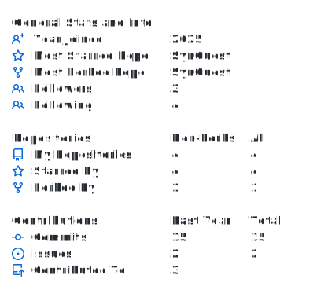
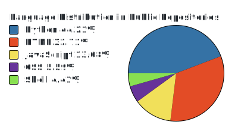

# Starry | Bioinformatics & DS

## About

Good Day. I am **Starry**, a Bioinformatics undergraduate at Soochow University, expected 2027.

My work sits at the intersection of three threads:

- **Bioinformatics research:** Single-cell analysis, transcriptomics algorithms, microbial genomics, and clinical genomics workflows.
- **Source-grounded AI systems:** Agents that keep generation tied to registered sources, retrieval evidence, and validation reports.
- **Decision analytics:** Data products that separate real signal from exposure, timing, and subsidy effects.

## Research And Analysis

- **Post-MI immune remodeling:** scRNA-seq and bulk RNA-seq analysis for glucosamine nanotherapy, with QC, integration, annotation, differential signals, and mechanism synthesis.
- **Microbial genomics:** genome assembly, annotation, contamination screening, and ANI assessment for a submission-ready *Latilactobacillus sakei* genome resource.
- **Clinical genomics:** structural-variant workflow review across caller outputs, breakpoint evidence, VCF/BEDPE conversion, visualization, and reporting usability.
- **Business analytics:** discount effectiveness and subsidy ROI analysis separating natural consumption cycles, exposure lift, conversion changes, and marginal discount efficiency.

## Toolbox

<table>
  <tr>
    <td><b>Languages</b></td>
    <td>Python, R, SQL</td>
  </tr>
  <tr>
    <td><b>AI systems</b></td>
    <td>LangGraph, RAG, hybrid retrieval, tool calling, context engineering, validation reports</td>
  </tr>
  <tr>
    <td><b>Data science</b></td>
    <td>pandas, scikit-learn, SHAP, regression diagnostics, metric design</td>
  </tr>
  <tr>
    <td><b>Bioinformatics</b></td>
    <td>single-cell analysis, transcriptomics, microbial genomics, clinical genomics</td>
  </tr>
  <tr>
    <td><b>Engineering</b></td>
    <td>FastAPI, Docker, pytest, GitHub Actions</td>
  </tr>
</table>

## Current Focus

- Building source-grounded agents for scientific and educational content delivery.
- Making bioinformatics analysis workflows easier to audit, reproduce, and explain.
- Turning noisy operational data into decision-ready evidence and reusable metric cards.

## GitHub Snapshot

---

**Do not go gentle into that good night.**

